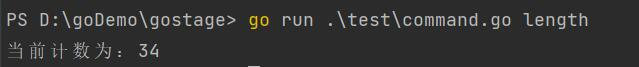
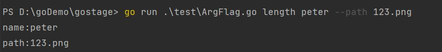

# gostage

gostage是一个快速搭建常驻服务的命令行脚手架。

## 安装
```shell
go get github.com/PeterYangs/gostage
```

## 快速开始
编写一个每秒往一个文件中写入一行文本的服务
```go
package main

import (
	"context"
	"fmt"
	"github.com/PeterYangs/gostage"
	"os"
	"time"
)

func main() {

	g := gostage.NewStage(context.Background())

	//绑定主服务逻辑
	g.StartFunc(func(request *gostage.Request) (string, error) {

		//打开文件
		file, err := os.OpenFile("word.txt", os.O_CREATE|os.O_RDWR, 0644)

		if err != nil {

			return "",err
		}

		//计数
		index := 0

		defer file.Close()

		for {

			select {

			case <-request.GetCxt().Done():

				return "",nil

			default:

				//打印计数到终端
				fmt.Println(index)

				//每秒写入一行文本
				time.Sleep(1 * time.Second)

				file.Write([]byte("word\n"))

				index++

			}

		}

	})

	err := g.Run()

	if err != nil {

		fmt.Println(err)
	}

}
```

#### 启动
```shell
go run stage.go 或 go run stage.go start
```

#### 守护进程
```shell
go  go run stage.go start -d
```

#### 停止
```shell
go run stage.go stop
```

#### 帮助
```shell
go run stage.go help
```

## 自定义命令
自定义一个`length`命令来获取实时的计数
```go
package main

import (
	"context"
	"fmt"
	"github.com/PeterYangs/gostage"
	"os"
	"strconv"
	"time"
)

func main() {

	g := gostage.NewStage(context.Background())

	//绑定主服务逻辑
	g.StartFunc(func(request *gostage.Request) (string, error) {

		//打开文件
		file, err := os.OpenFile("word.txt", os.O_CREATE|os.O_RDWR, 0644)

		if err != nil {

			return "",err
		}

		//计数
		index := 0

		defer file.Close()

		for {

			select {

			case <-request.GetCxt().Done():

				return "",nil

			default:

				//打印计数到终端
				fmt.Println(index)

				//存储计数到常驻变量
				request.Set("length", strconv.Itoa(index))

				//每秒写入一行文本
				time.Sleep(1 * time.Second)

				file.Write([]byte("word\n"))

				index++

			}

		}

	})

	g.AddCommand("length", "获取当前计数.", func(request *gostage.Request) (string, error) {

		return "当前计数为：" + request.Get("length"), nil
	})

	err := g.Run()

	if err != nil {

		fmt.Println(err)
	}

}
```

执行命令
```shell
go run stage.go length
```
结果为




## 设置Arg和flag
```go
package main

import (
	"context"
	"fmt"
	"github.com/PeterYangs/gostage"
	"os"
	"strconv"
	"time"
)

func main() {

	g := gostage.NewStage(context.Background())

	//绑定主服务逻辑
	g.StartFunc(func(request *gostage.Request) (string, error) {

		//打开文件
		file, err := os.OpenFile("word.txt", os.O_CREATE|os.O_RDWR, 0644)

		if err != nil {

			return "",err
		}

		//计数
		index := 0

		defer file.Close()

		for {

			select {

			case <-request.GetCxt().Done():

				return "",nil

			default:

				//打印计数到终端
				fmt.Println(index)

				//存储计数到常驻变量
				request.Set("length", strconv.Itoa(index))

				//每秒写入一行文本
				time.Sleep(1 * time.Second)

				file.Write([]byte("word\n"))

				index++

			}

		}

	})

	l := g.AddCommand("length", "获取当前计数.", func(request *gostage.Request) (string, error) {

		str := ""

		str += "name:" + request.GetArg("name") + "\n"
		str += "path:" + request.GetFlag("path")

		return str, nil
	})

	l.Arg("name", "名称").Required()

	l.Flag("path", "路径")

	err := g.Run()

	if err != nil {

		fmt.Println(err)
	}

}
```

执行命令
```shell
go run stage.go length peter --path 123.png
```
结果为



## 设置

```go
package main

import (
	"context"
	"fmt"
	"github.com/PeterYangs/gostage"
	"os"
	"time"
)

func main() {

	g := gostage.NewStage(context.Background())

	//执行用户
	g.SetRunUser("nginx")

	//运行文件(pid、sock等文件)的存放路径
	g.SetRunPath("run")

	//日志文件路径
	g.SetLogPath("logs")

	//绑定主服务逻辑
	g.StartFunc(func(request *gostage.Request) (string, error) {

		//打开文件
		file, err := os.OpenFile("word.txt", os.O_CREATE|os.O_RDWR, 0644)

		if err != nil {

			return "", err
		}

		//计数
		index := 0

		defer file.Close()

		for {

			select {

			case <-request.GetCxt().Done():

				return "", nil

			default:

				//打印计数到终端
				fmt.Println(index)

				//每秒写入一行文本
				time.Sleep(1 * time.Second)

				file.Write([]byte("word\n"))

				index++

			}

		}

	})

	err := g.Run()

	if err != nil {

		fmt.Println(err)
	}

}
```

